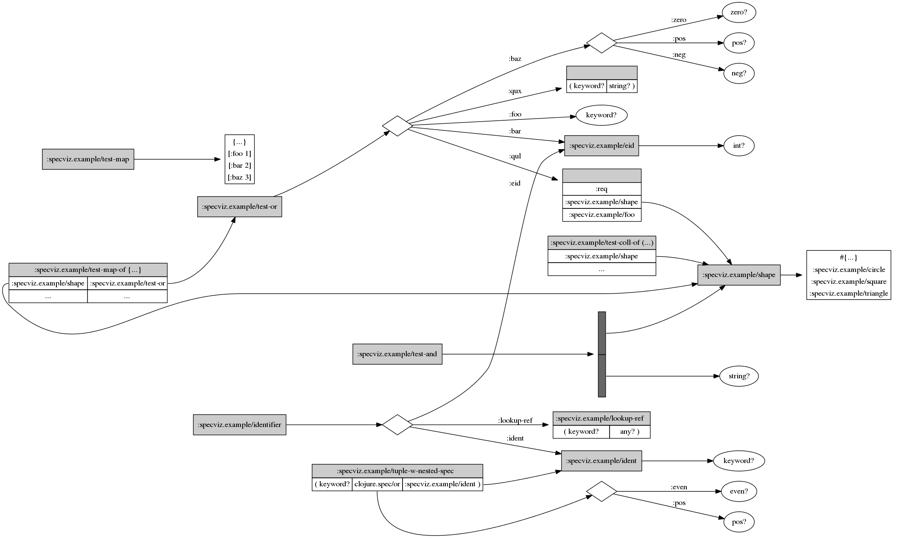

# specviz

Generate [Graphviz](https://www.graphviz.org) images from [clojure.spec](https://clojure.org/about/spec).

## Release

### Leiningen dependency

```
[specviz "0.2.3"]
```

## Usage

Create a diagram of all specs in the `specviz.example` namespace, and their
dependencies. The file will be exported to `foo.png`.

```
user=> (require '[specviz.core :as specviz])
nil
user=> (specviz/diagram 'specviz.example nil "foo")
```



Create a diagram for the `:specviz.graphviz/drawable` spec.

```
user=> (specviz/diagram :specviz.graphviz/drawable nil "bar")
```


## Status

The following spec types are supported.

* keys
* and
* or
* every
* tuple

Regex specs are currently in development.

## Change Log

### 0.2.0

* Fix SOE due to recursive specs
* Render `s/nilable?` using `s/or :nil nil? :not-nil ...`
* Render map, set, vector literals using a table
* Always filter out `clojure.core` specs

## License

The MIT License (MIT)

Copyright (c) 2016 Jeb Beich

Permission is hereby granted, free of charge, to any person obtaining
a copy of this software and associated documentation files (the
"Software"), to deal in the Software without restriction, including
without limitation the rights to use, copy, modify, merge, publish,
distribute, sublicense, and/or sell copies of the Software, and to
permit persons to whom the Software is furnished to do so, subject to
the following conditions:

The above copyright notice and this permission notice shall be
included in all copies or substantial portions of the Software.

THE SOFTWARE IS PROVIDED "AS IS", WITHOUT WARRANTY OF ANY KIND,
EXPRESS OR IMPLIED, INCLUDING BUT NOT LIMITED TO THE WARRANTIES OF
MERCHANTABILITY, FITNESS FOR A PARTICULAR PURPOSE AND NONINFRINGEMENT.
IN NO EVENT SHALL THE AUTHORS OR COPYRIGHT HOLDERS BE LIABLE FOR ANY
CLAIM, DAMAGES OR OTHER LIABILITY, WHETHER IN AN ACTION OF CONTRACT,
TORT OR OTHERWISE, ARISING FROM, OUT OF OR IN CONNECTION WITH THE
SOFTWARE OR THE USE OR OTHER DEALINGS IN THE SOFTWARE.
